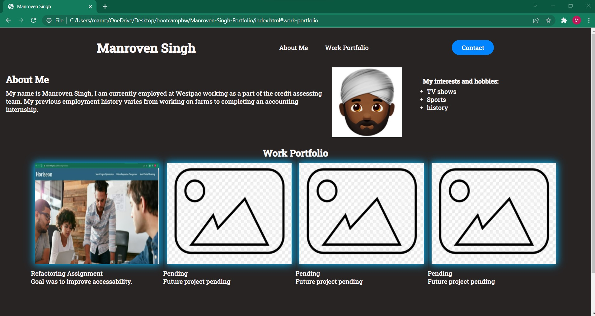

# Manroven-Singh-Portfolio

This is V1.0 of a coding portfolio, that will be used to demonstrate to future employers my coding skills. The content currently shown on the website is very basic, especially the 'work portfolio' section which is limited to one refactoring assignment. The website currently illustrates the CSS skills we have developed such as flexbox, color effects (e.g. shadows) and dynamic pseudo-classes (hover feature). Additionally, the HTML page has a fuctional nav section and hyperlink images. 

This is how the website currently looks (click picture to go to the website or the link)
 
  <a href="https://manny1998.github.io/Manroven-Singh-Portfolio/">Deployed Portfolio </a>

